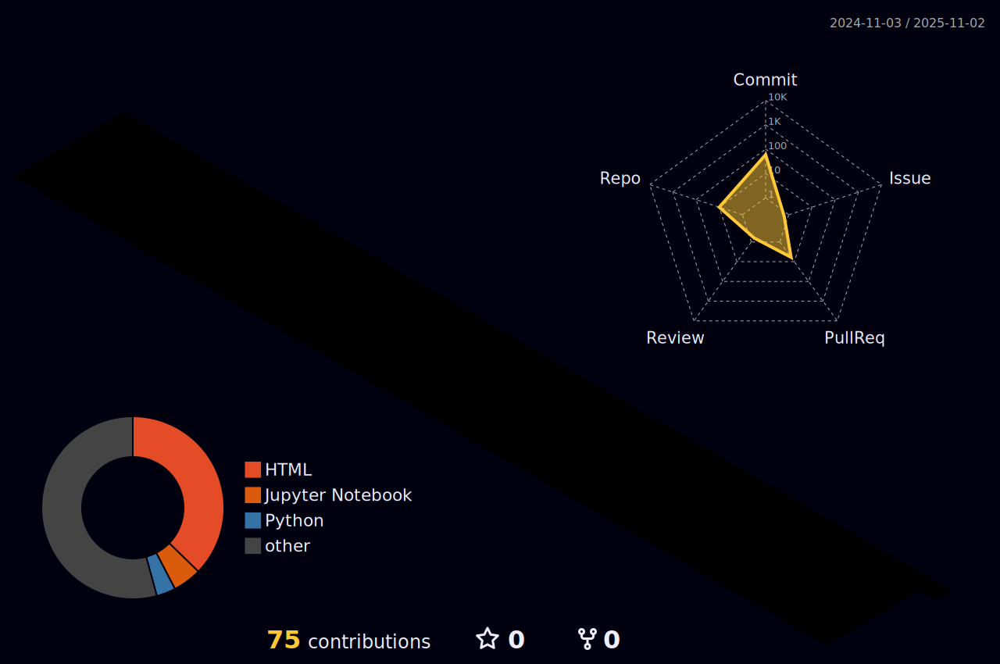

  <!-- Snake Code Contribution Map -->
  <picture>
    <source media="(prefers-color-scheme: dark)" srcset="profile-snake-contrib/github-contribution-grid-snake-dark.svg" />
    <source media="(prefers-color-scheme: light)" srcset="profile-snake-contrib/github-contribution-grid-snake.svg" />
    
  </picture>

## 📊 Coding Activity & Statistics

<!-- GitHub Streak Statistics -->

  <table>
    <tr>
      <td>
        <picture>
          <source media="(prefers-color-scheme: dark)" srcset="readme-assets/streak-stats-dark.svg" />
          <source media="(prefers-color-scheme: light)" srcset="readme-assets/streak-stats-light.svg" />
          
        </picture>
      </td>
    </tr>
  </table>
  

<!-- GitHub Activity Graph -->
<picture>
  <source media="(prefers-color-scheme: dark)" srcset="readme-assets/activity-graph-dark.svg" />
  <source media="(prefers-color-scheme: light)" srcset="readme-assets/activity-graph-light.svg" />
  
</picture>

## 📦 GitHub Metrics

<!-- 

<table>
  <tr>
    <td></td>
    <td></td>
  </tr>
  <tr>
    <td></td>
    <td></td>
  </tr>
  <tr>
    <td></td>
    <td></td>
  </tr>
  <tr>
    <td></td>
    <td></td>
  </tr>
  <tr>
    <td></td>
    <td></td>
  </tr>
  <tr>
    <td></td>
    <td></td>
  </tr>
</table> -->

<!-- 3D Contribution Graph -->
<picture>
  <source media="(prefers-color-scheme: dark)" srcset="profile-3d-contrib/profile-night-rainbow.svg" />
  <source media="(prefers-color-scheme: light)" srcset="profile-3d-contrib/profile-gitblock.svg" />
  
</picture>

<!-- RepoBeats Analytics -->

